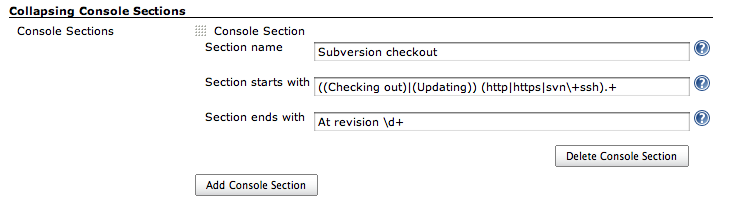
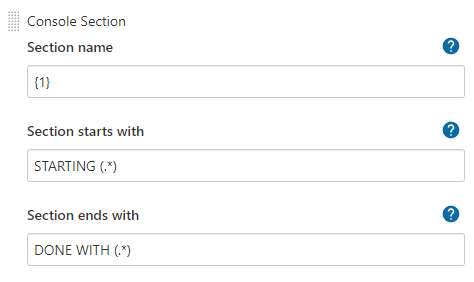
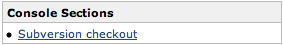

# Collapsing Console Sections Plugin for Jenkins

[](https://plugins.jenkins.io/collapsing-console-sections)
[](https://github.com/jenkinsci/collapsing-console-sections-plugin/releases/latest)
[](https://plugins.jenkins.io/collapsing-console-sections)

This plugin allows the creation of sections in build consoles.
These sections can be individually collapsed to hide unimportant details.
A floating outline widget is available to navigate through all the sections of a build.

## Basic Usage

Once this plugin is installed, you can define console sections from _Manage Jenkins > System Configuration > Configure System_.

Each console section is defined by a display name, a Java regular expression pattern that identifies the start of the section in log files, and a second regex that identifies the end of the section.

Starting with version `1.2` of this plugin, captured groups from the start-of-section regular expression can be referenced from the section display name.
Simply use {`1`}, {`2`}, and so forth in the place where you want to insert the value of the corresponding capture group of the regular expression.



In the below example an text following the occurance of the word `STARTING ` in the logs will be used as the Section Name. 



After console sections have been defined, any section definition that matches contents of a visited build console URL will cause the that section to be annotated in the browser window.
Visibility of the section contents can be toggled with the _Hide/Show_ link.


A floating navigation widget is also inserted into the left-side navigation to aid movement between console sections.



## Programmatic Usage

If you want to provide a pre-canned set of sections for your organization's Jenkins installation,
you can create a plugin that depends on this plugin, and programmatically create section definitions.
Create instances of `SectionDefinition` to define sections, and then create a `ConsoleAnnotatorFactory` subclass that returns an instance of
`CollapsingSectionAnnotator`.
Here is a simple example that creates a section around Subversion checkouts.

``` java
import hudson.Extension;
import hudson.console.ConsoleAnnotator;
import hudson.console.ConsoleAnnotatorFactory;
import hudson.model.Run;
import org.jvnet.hudson.plugins.collapsingconsolesections.CollapsingSectionAnnotator;
import org.jvnet.hudson.plugins.collapsingconsolesections.SectionDefinition;


@Extension
public class SubversionAnnotatorFactory extends ConsoleAnnotatorFactory<Class<Run>> {
    @Override
    public ConsoleAnnotator newInstance(Class<Run> context) {
        SectionDefinition svnSection = new SectionDefinition( "Subversion Checkout",
                "((Checking out)|(Updating) (http|https|svn\\+ssh).+",
                "At revision \\d+.+" );
        return new CollapsingSectionAnnotator( svnSection );
}
```

The signature for `CollapsingSectionAnnotator`'s constructor is

``` java
public CollapsingSectionAnnotator( SectionDefinition... definitions );
```

So you can use a single annotator that defines multiple console sections.

## Changelog

* For recent versions, see [GitHub releases](https://github.com/jenkinsci/collapsing-console-sections-plugin/releases)
* For versions `1.7.0` and before, see the [changelog archive](docs/OLD_CHANGELOG.md)
